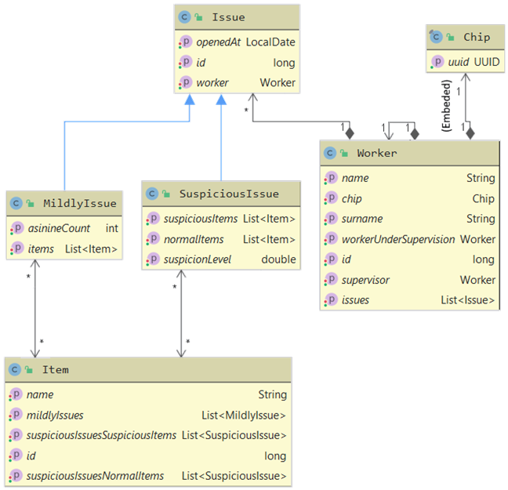

# Object to CSV mapper
A Object to CSV  (and vice-versa) Mapper library.
## API
This library has a very simple API that includes two classes, one interface and nine annotations.
 - `TypeConverter<T>` is the interface used for converting value objects to string and vice versa. The interface has two methods to implement:
	- `T convertToTypeObject(String value, String formatter)`
	- `String convertToString(T value, String formatter)`

	The formatter argument provides string value from the CsvFormatter annotation that can be ignored.
	The library provides overridable converters for the following classes: basic types and their classes, BigDecimal, BigInteger, LocalDate (with formatter), LocalDateTime (with formatter), String, UUID. Float and Double converters supports locale for language tag formatter.

- `InMemoryCsvFile` provides in-memory representation of an csv file.
	- `String getName(), String getFilePath()`- returns the csv file name.
	- `String[] getData()`- returns  file rows.
- `CsvMapper`- has two constructors:
	- `CsvMapper(String basePath, String delimiter)`- for on-disk files, accepts the path of the directory containing CSV files.
	- `CsvMapper(String delimiter)`- for in-memory files.

	And following methods:
	- `void registerConverter(Class<T> clazz, TypeConverter<T> converter)`
	- `List<T> filesToList(Class<T> clazz) throws CsvMappingException, IOException`
	- `List<T> filesToList(Class<T> clazz, List<InMemoryCsvFile> files) throws CsvMappingException, IOException`
	- `List<InMemoryCsvFile> listToCsvInMemoryFile(List<T> objects) throws CsvMappingException`
	- `void listToFiles(List<T> objects) throws CsvMappingException, IOException`

Annotations:
- `@CsvColumn`:
	- `name`- maps field to the column with the specified name. Names containing @ and # symbols are not allowed.
- `@CsvTransient`- the library ignores fields with this annotation.
- `@CsvFormatter`- provides the formatting string for value converters.
- `@CsvId`- marks the specified field as the entity identifier. Its value should be entity unique. The field type must be a value type.
- `@CsvEntity`:
	- `name` (optional)- maps class to the CSV file with the specified name
- `@CsvManyToOne`- marks the specified field as the end of a one-to-many relation. The field type must be an entity.
	- `endFieldName`- the name of the field on the other side of this relationship (one-to-many).
- `@CsvOneToMany`- marks the specified field as the end of a many-to-one relation. The field must be a collection of entities and it must be initialized in the default constructor.
	- `endFieldName`- the name of the field on the other side of this relationship (many-to-one).
- `@CsvManyToMany`- marks the specified field as the end of a many-to-many relation. The field must be a collection of entities and it must be initialized in the default constructor.
	- `endFieldName`- the name of the field on the other side of this relationship.
- `@CsvManyToOne`- marks the specified field as the end of a many-to-one relation. The field type must be an entity.
	- `endFieldName`- the name of the field on the other side of this relationship (one-to-one).
	- `appendToFile`- if set to true, the foreign key is appended on that side of the relationship. It is required for this attribute to be set as true on one side of the relation.
## Entity class requirements:
- it must be annotated with @CsvEntity;
- to be included the base class also must be annotated with @CsvEntity;
- it must have a parameterless constructor;
- it must have java bean style field accessors;
- one-to-many and many-to-many relation fields must be a collection;
- relations collections must be initialized on default by the user;
- the relation must be marked on both sides;
## Library limitations:
- no support for maps;
- no support for value-type collections;
- no support for entity arrays (relations);
- no value-type arrays support by default;
## Example:
The example code is available [here](src/test/java/test/data).
Based on classes presented on the diagram underneath:



The library generates the files with the following headers:
- **Issues.csv** - issueId; worker@Worker.csv; openedAt; asinineCount; items@Items.csv; suspicionLevel; normalItems@Items.csv; suspiciousItems@Items.csv; #TYPE
- **Items.csv**- id; name; mildlyIssues@Issues.csv; suspiciousIssuesNormalItems@Issues.csv; suspiciousIssuesSuspiciousItems@Issues.csv
- **Worker.csv**- workerId; name; surname; supervisor@Worker.csv; chip

The code:
```java
var mapper = new CsvMapper(";"); //sets mapper for files in memory instance
mapper.registerConverter(Chip.class, new ChipConverter());
var in = getWorkers(); //Generates data
var files = mapper.listToCsvInMemoryFile(in); //returns in-memory files
```